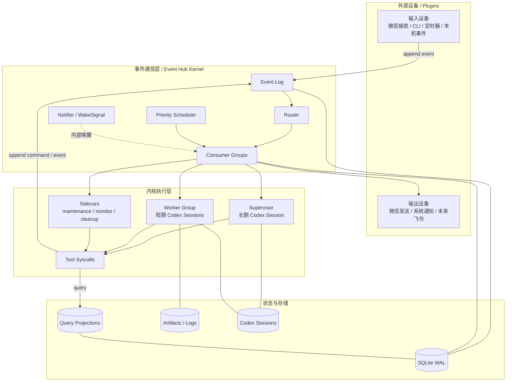

# 技术方案

## 定位

Personal Codex Supervisor 是一个本地运行的个人助手运行时。它不是“微信直接套 Codex”的聊天机器人，而是一个操作系统式的运行时：

```text
外部设备插件
  -> Event Hub Kernel
  -> Supervisor / Worker Group / Sidecars
  -> Tool Syscalls
  -> Event Hub Kernel
  -> 外部设备插件或查询投影
```

Codex 负责智能判断和执行能力。运行时负责秩序：事件通信、异步调度、状态持久化、任务追踪、外部副作用、崩溃恢复和插件边界。

## 总体架构



## 技术栈

```text
语言：TypeScript
运行时：Node.js 24 LTS
数据库：SQLite WAL
SQLite driver：better-sqlite3
包管理：pnpm
Schema：zod
日志：pino
测试：vitest
Codex 调用：node:child_process spawn
部署：本机 daemon + launchd
```

TypeScript / Node.js 适合本项目的事件驱动、子进程编排、JSON schema、工具协议和插件开发。Go 更适合单二进制系统服务，但对本项目早期快速调整 prompt、tool contract 和事件协议不如 TypeScript 顺手。Python 可以作为 worker 内部可调用脚本语言，但不建议作为主 daemon 语言。

## 目录结构

```text
src/
  main.ts
  runtime/
    daemon.ts
    lifecycle.ts
    config.ts

  kernel/
    event-hub/
      append.ts
      router.ts
      deliveries.ts
      scheduler.ts
      consumer-runner.ts
      notifier.ts
      retry.ts
      types.ts
    projections/
      projector.ts
      tasks.ts
      sessions.ts
      outbox.ts
      system-health.ts

  agents/
    supervisor/
      runner.ts
      context-builder.ts
      session-manager.ts
      turn-lock.ts
      skill.md
    worker/
      runner.ts
      context-builder.ts
      skill.md

  tools/
    registry.ts
    supervisor-tools.ts
    worker-tools.ts
    message-tools.ts
    task-tools.ts
    schedule-tools.ts
    state-tools.ts

  plugins/
    wechat/
      receiver.ts
      sender.ts
      plugin.ts
    scheduler/
      plugin.ts
    cli/
      commands.ts
    local/
      plugin.ts

  codex/
    runner.ts
    session-registry.ts
    output-parser.ts

  sidecars/
    session-maintenance.ts
    health-monitor.ts
    cleanup.ts

  storage/
    sqlite.ts
    migrations.ts
```

## Event Hub Kernel

Event Hub 是模块间唯一可靠业务通信通道。插件、Supervisor、Worker Group、Sidecars 都通过它交换 command 和 event。

这里的 command 不是命令行调用，而是系统内部的意图消息：

```text
command = 希望系统做某事
event = 某事已经发生
query = 查询当前状态
```

统一消息 envelope：

```ts
type HubMessage = {
  id: string
  kind: "command" | "event"
  type: string
  topic: string
  source: string
  priority: number
  payload: unknown
  correlationId: string
  causationId?: string
  dedupeKey?: string
  scheduledAt?: string
  createdAt: string
}
```

核心表：

```text
event_log
event_deliveries
consumer_groups
dead_letters
projection_offsets
tasks
task_runs
sessions
artifacts
```

`event_deliveries` 记录一条消息对某个 consumer group 的投递状态：

```text
pending
running
acked
failed
dead_letter
```

关键字段：

```text
group_id
message_id
status
priority
available_at
lease_until
attempts
locked_by
last_error
```

## Notifier / WakeSignal

`WakeSignal` 放在 `kernel/event-hub/notifier.ts`，只作为 Event Hub 内部调度优化，不作为业务通信通道。

写入消息时：

```text
append command/event
  -> SQLite transaction 写 event_log
  -> router 计算投递 consumer groups
  -> 写 event_deliveries
  -> commit
  -> notifier.wake(affected_groups)
```

消费者运行时：

```text
claim ready deliveries
  -> 有消息就处理
  -> 没消息就 wait wake signal
  -> timeout 后 fallback scan
```

可靠性靠 SQLite event log 和 deliveries；低延迟靠 wake；兜底靠 fallback scan。

## Consumer Groups

建议的 consumer groups：

```text
supervisor_group       消费用户消息、重要任务事件、系统告警
worker_group           消费 command.task.*
wechat_sender_group    消费 command.message.send_wechat
projection_group       消费所有需要投影的消息
maintenance_group      消费维护类事件
monitor_group          消费和产生健康检查事件
```

Supervisor 并发固定为 1。Worker Group 并发可配置，默认可以从 5 开始。所有消费者都通过 lease / ack / retry 保证崩溃可恢复。

## Supervisor

Supervisor 是长期 Codex session，逻辑身份稳定：

```text
wechat_main -> current_supervisor_session_id
```

底层 session 可以更换。比如每天凌晨 02:00 由 session maintenance 生成 handoff summary，然后创建新的主 session，并更新 current 指针。主流程不需要感知换线细节。

Supervisor 消费：

```text
event.wechat.message_received
event.task.completed
event.task.failed
event.task.needs_decision
event.system.alert
event.maintenance.handoff_required
```

Supervisor 职责：

```text
理解用户
维护长期上下文和偏好
判断是否需要后台任务
调用工具发起 command 或查询状态
处理 worker 回传的 task event
决定是否通知用户
统一生成普通业务消息
```

Supervisor 不应该：

```text
长时间阻塞执行复杂任务
轮询等待 worker 完成
绕过消息插件直接发送外部消息
把完整聊天历史塞给 worker
```

## Worker Group

Worker Group 消费：

```text
command.task.start
command.task.continue
command.task.cancel
```

每个 worker run 默认创建新的 Codex session，并记录：

```text
task_id
run_id
worker_session_id
artifact_dir
status
started_at
finished_at
```

Worker 职责：

```text
理解 Supervisor 给出的任务目标、上下文和验收标准
使用可用工具执行复杂工作
保存日志和 artifact
输出结构化 task event
```

Worker 不直接给用户发消息。如果需要用户确认，输出 `event.task.needs_decision`，由 Supervisor 决定是否询问用户以及如何表达。

## Tool Syscalls

工具是 Codex agent 调用系统能力的入口。读工具同步查询 projections，写工具追加 command/event 到 Event Hub。

当前实现不把内部工具暴露成 MCP server，而是采用 skill-like 的提示方式：运行时把可用工具列表、角色说明和结构化调用格式写进 prompt；Codex 如需调用工具，就返回 `toolCalls` JSON；运行时校验 schema、执行工具、把结果回填给同一个 Codex session 继续推理。

Supervisor tools：

```text
task.start
task.continue
task.cancel
task.get_status
task.get_result
task.list_active

message.send_wechat

state.get_recent_events
state.get_system_status
task.mark_event_handled
```

Worker tools：

```text
task.report_progress
task.register_artifact
task.needs_decision
state.get_task_context
```

判断一个工具调用是否应该进入 Event Hub 的标准：

```text
是否需要异步执行
是否需要跨模块处理
是否需要崩溃后恢复
是否需要 ack / retry / 去重
是否会产生外部副作用
是否需要审计和追踪
```

例如 `task.get_status` 是 query，不进 Event Hub。`message.send_wechat` 是外部副作用，必须写 `command.message.send_wechat`。

## 插件模型

插件是外部设备驱动。

输入插件只负责把外部输入转成 event：

```text
wechat.receiver -> event.wechat.message_received
cli.commands -> event.manual.command_received
scheduler.plugin -> event.timer.due
local.plugin -> event.local.*
```

输出插件消费 command 并写回结果 event：

```text
command.message.send_wechat
  -> wechat.sender
  -> event.message.sent / event.message.send_failed
```

未来飞书、邮件、本机通知都按同样模型接入，不改变 Event Hub、Supervisor 或 Worker 的核心边界。

## Query Projections

事件通信负责“发生了什么”，查询状态不靠等待事件，而靠投影表。

建议投影：

```text
tasks_current_state
task_runs_current_state
sessions_current_state
outbox_current_state
recent_task_events
system_health_current_state
```

Supervisor 查询任务状态时走 `task.get_status` / `task.get_result`，读取 projections，而不是向 Worker 发消息等待回复。

## 关键流程

### 微信输入

```text
wechat.receiver
  -> event.wechat.message_received
  -> Event Hub routes to supervisor_group
  -> Supervisor Codex session
  -> message.send_wechat 或 task.start
```

### 启动任务

```text
Supervisor
  -> task.start
  -> command.task.start
  -> worker_group
  -> Worker Codex session
  -> event.task.completed / failed / needs_decision
  -> supervisor_group
```

### 发送微信

```text
Supervisor
  -> message.send_wechat
  -> command.message.send_wechat
  -> wechat_sender_group
  -> event.message.sent / event.message.send_failed
```

### Session Maintenance

```text
scheduler
  -> event.maintenance.handoff_required
  -> maintenance_group
  -> 生成 handoff summary
  -> 创建新 supervisor session
  -> 更新 current_supervisor_session_id
```

## 开发顺序

开发顺序按依赖推进，但架构目标是完整产品：

```text
1. TypeScript 工程、配置、SQLite migration
2. Event Hub：append、routing、deliveries、consumer runner、notifier
3. Projections 和查询状态表
4. Codex runner 和 session registry
5. Tools registry、Supervisor tools、Worker tools
6. Supervisor runner 和 Worker Group
7. CLI plugin、scheduler plugin、wechat plugin
8. Session maintenance、health monitor、cleanup
9. 测试、日志、launchd 部署说明
```

## 隐私边界

技术方案和开源代码不应包含个人部署信息、真实聊天记录、真实任务内容、真实联系人、真实日程、凭据、令牌、私有 prompt 或机器路径。个人实例配置、状态、日志和 artifacts 必须放在 ignored 的本地目录中。
